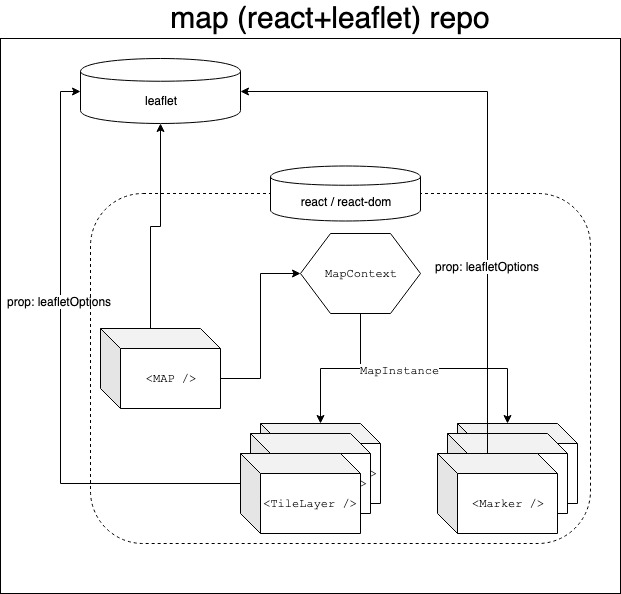

# React Maps

Loosely implemented package using react with leaflet.
As compared to the existing [react-leaflet](https://react-leaflet.js.org/), we want to set up things different in this repo:

- React and leaflet are decoupled as much as possible. We don't want to introduce any side effects based on leaflet options, methods and events. This way it's way less painful updating the leaflet dependency.
- Build components the 'react way', no extending js classes.
- Barely any documentation. Users should just be referred to the existing leaflet documentation.
- Pluggable: by using the `useMapInstance`, users can just attach their own plugin / leaflet extension to the map instance.



## Usage

Install dependencies: `yarn`
Start the example app: `yarn start` and check out `http://localhost:8080`

Checkout `./src/example/App.tsx` for how to implement the components.

### Link to existing project

First build the package: `yarn build`
Then simply execute `yarn link` in this repo, then in your repo where you want implement this package `yarn link "@datapunt/react-maps"`

Then we have just one issue: we now have two react dependencies: one in your project, and the one in this repo. This will unfortunately resolve in an error. There are two ways of fixing this:

1. Add the following to your webpack config:
```js
...
resolve: {
  modules: ['node_modules'],
  extensions: ['.js', '.jsx'],
  alias: {
    react: path.resolve('./node_modules/react'),
    'react-dom': path.resolve('./node_modules/react-dom'),
  },
},
```

2. In case you don't have a webpack config, or using create-react-app Manually delete `react` and `react-dom` folder in this repo in the `node_modules`.
